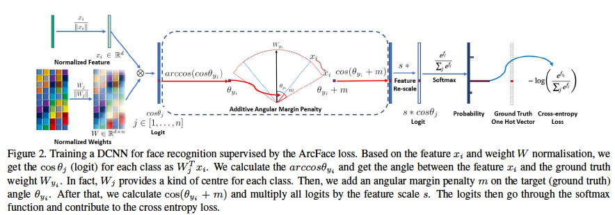
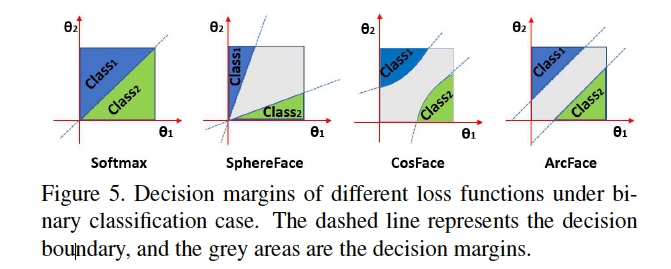

# ArcFace: Additive Angular Margin Loss for Deep Face Recognition

## Abstract

>One of the main challenges in feature learning using Deep Convolutional Neural Networks (DCNNs) for largescale face recognition is the design of appropriate loss functions that can enhance the discriminative power.

大規模な顔認識のための深層畳み込みニューラルネットワーク（DCNN）を用いた特徴学習における主な課題の一つは、識別力を高めることができる適切な損失関数を設計することである。

>Centre loss penalises the distance between deep features and their corresponding class centres in the Euclidean space to achieve intra-class compactness.

センターロスは、クラス内のコンパクト性を実現するために、ユークリッド空間における深層特徴とその対応するクラスセンターとの間の距離をペナルティとして与えます。

>SphereFace assumes that the linear transformation matrix in the last fully connected layer can be used as a representation of the class centres in the angular space and therefore penalises the angles between deep features and their corresponding weights in a multiplicative way.

SphereFaceでは、最後の完全連結層の線形変換行列を、角度空間におけるクラスセンターの表現として使用できると仮定し、深層特徴とそれに対応する重みの間の角度に乗算方式でペナルティを課します。

>Recently, a popular line of research is to incorporate margins in well-established loss functions in order to maximise face class separability.

最近では、顔クラスの分離可能性を最大化するために、確立された損失関数にマージンを組み込む研究が盛んに行われている。

>In this paper, we propose an Additive Angular Margin Loss (ArcFace) to obtain highly discriminative features for face recognition.

本論文では、顔認識のための識別性の高い特徴を得るために、Additive Angular Margin Loss (ArcFace)を提案する。

>The proposed ArcFace has a clear geometric interpretation due to its exact correspondence to geodesic distance on a hypersphere.

提案するArcFaceは、超球面上の測地線距離に正確に対応しているため、明確な幾何学的解釈が可能である。

>We present arguably the most extensive experimental evaluation against all recent state-of-the-art face recognition methods on ten face recognition benchmarks which includes a new large-scale image database with trillions of pairs and a large-scale video dataset.

本論文では、何兆ものペアを持つ新しい大規模画像データベースと大規模ビデオデータセットを含む10種類の顔認識ベンチマークを用いて、最近の最先端の顔認識手法に対する最も広範な実験的評価を行っています。

>We show that ArcFace consistently outperforms the state of the art and can be easily implemented with negligible computational overhead.

その結果、ArcFaceは常に最新の技術を凌駕し、ごくわずかな計算オーバーヘッドで簡単に実装できることがわかりました。

## Conclusions

本論文では，顔認識のためにDCNNで学習した特徴埋め込みの識別力を効果的に高めることができるAdditive Angular Margin Loss関数を提案する．この手法は、DCNNで学習した特徴埋め込みの識別力を効果的に高めることができる。本論文で報告された結果の再現性を高めるために、詳細な説明付きのコードを公開します。

## Proposed Approach

### softmax loss

分類でよく使われていた誤差関数

$$
L_{1}=-\frac{1}{N} \sum_{i=1}^{N} \log \frac{e^{W_{y_{i}}^{T} x_{i}+b_{y_{i}}}}{\sum_{j=1}^{n} e^{W_{j}^{T} x_{i}+b_{j}}}
$$

* $x_i \in \mathbb{R^d}$ : $y_i$-th class に所属している $i$番目のサンプルの特徴量(d=512)

* $W_j \in \mathbb{R^d}$ : 重み $W \in \mathbb{R}^{d \times n}$ の $j$-th column

* $b_j \in \mathbb{R^n}$ : バイアス項

* $N$ : batch size

* $n$ : class数

問題点として，クラス内サンプルでは高い類似性を，クラス間サンプルでは多様性を確保するように，特徴量の埋め込みを明示的に最適化していないため，クラス内の外観変化が大きい場合の深層顔認識では性能差が生じる

クラス内の外観変化の例として，pose variations, age gaps, large-scale test scenarios がある，

### ArcFace の Loss

$$
L_{3}=-\frac{1}{N} \sum_{i=1}^{N} \log \frac{e^{s\left(\cos \left(\theta_{y_{i}}+m\right)\right)}}{e^{s\left(\cos \left(\theta_{y_{i}}+m\right)\right)}+\sum_{j=1, j \neq y_{i}}^{n} e^{s \cos \theta_{j}}}
$$

## Geometric Distance

ArcFace は　$\theta$ の空間できれいにマージンが掛けられる．　
