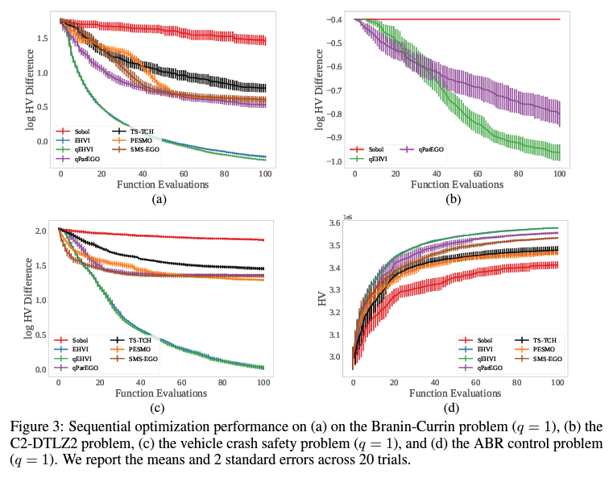

## 1. どんなもの？

1.3 Contributions

* モンテカルロ（MC）積分誤差まで厳密な，並列q-Expected Hypervolume Improvement acquisition function（qEHVI）の新しい定式化を導出

* 自動微分法を用いてqEHVIのMC推定量の正確な勾配を計算することで，効率的かつ効果的な勾配ベースの最適化手法を採用することができる

* 一次勾配法ではなく，サンプル平均近似（SAA）法を利用して高次の決定論的最適化法を用い，SAA法による理論的収束保証を証明した

* 我々のqEHVIの定式化は恥ずかしいほど並列であり、その計算コストにもかかわらず、無限の処理コアがあれば一定の時間複雑性を達成することが可能

* 最新のGPUハードウェアを使用し、厳密な勾配を計算することで、qEHVIの最適化は、多くの実用的なシナリオにおいて、既存の最先端の手法よりも高速であることを実証しました。

* さらに、qEHVIを拡張し、補助的な結果制約をサポートすることで、多くの現実的なシナリオで実用的なものにしています。最後に、解析的EHVIの厳密な勾配を計算するために、最新の自動微分法をどのように使用できるかを示します。

* 実証的な評価によると、qEHVIは最先端の多目的BOアルゴリズムよりも優れた性能を持ち、その使用時間はわずか数分の一であることがわかった。

## 2. 先行研究と比べてどこがすごいの？

## 3. 技術や手法の"キモ"はどこにある？

## 4. どうやって有効だと検証した？

## 5. 議論はあるか？

## 6. 次に読むべき論文はあるか？

### 論文情報・リンク

